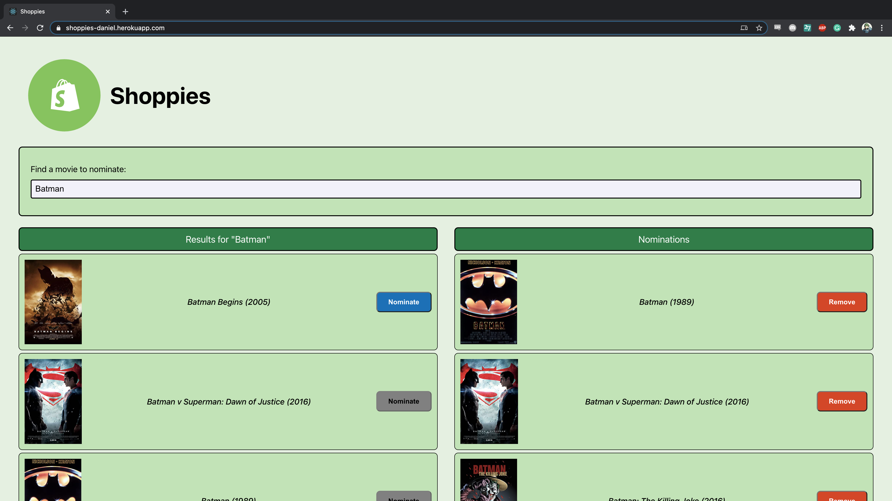
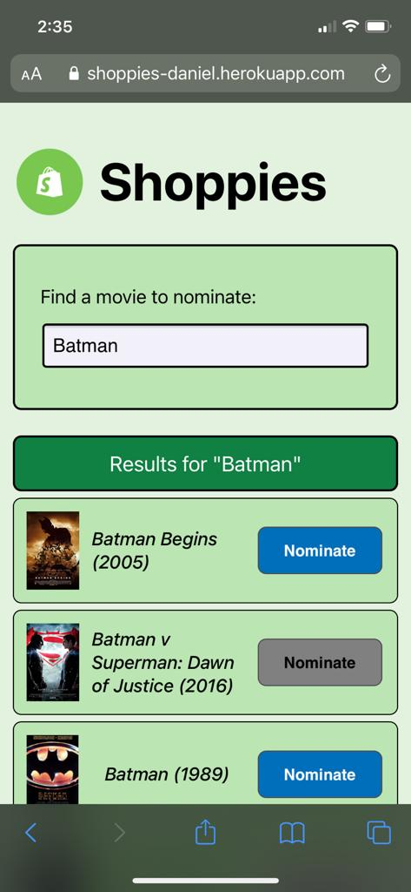
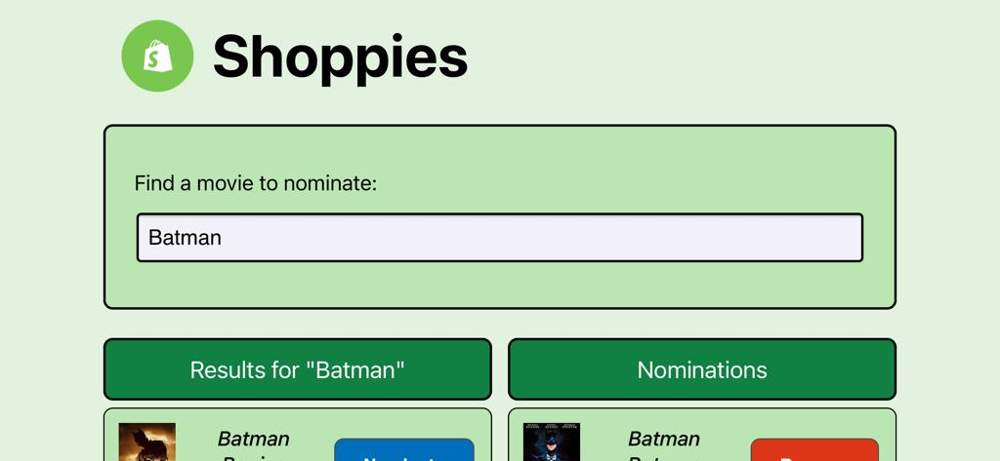

# Shoppies

## Background

This is my coding challenge project for the [Shopify 2021 internship application](https://jobs.smartrecruiters.com/ni/Shopify/ee14b4f1-62ec-4a47-850b-2311c57f855b-front-end-developer-intern-remote-summer-2021).

## Prerequisites

**OMDB API**

You'll first need to retrieve an API key via OMDB API [here](http://www.omdbapi.com/apikey.aspx).

After you've activated the API key, you'll need to configure the environment variable before running this app.

```
$ export REACT_APP_OMDB_API_KEY=YOUR_COOL_API_KEY_HERE;
```

NOTE: This must be initialized before running `npm start` otherwise the search will fail.

## Setup

NOTE: This assumes you have installed a Node version >= 10 as per the [Create React App docs](https://create-react-app.dev/docs/getting-started/).

Since we're using Create React App for this, setting it up after initializing the API requires the following command:

```
$ npm start
```

which as per the Create React docs does the following:

Runs the app in the development mode.\
Open [http://localhost:3000](http://localhost:3000) to view it in the browser.

The page will reload if you make edits.\
You will also see any lint errors in the console.

## Formatting

I chose to use [Prettier](https://prettier.io/) for automatically formatting my code to have one less thing to worry about.

You can run this after any change via the following command:

```
$ npm run prettier
```

Check out the `package.json` for more information on this script.

## Deployment

Heroku makes it really easy to deploy Create React Apps and I followed the instructions from this [wiki](https://blog.heroku.com/deploying-react-with-zero-configuration).

Be sure to set the Configuration Variable for your API key in order for search queries to perform sucessfully.

## Demos

### Desktop



### Mobile

**Portrait**



**Landscape**



### Accessibility

Most importantly, I built for accessibility in mind so please watch the video titled `app_demo.mp4` in the `readme_resources` folder.
